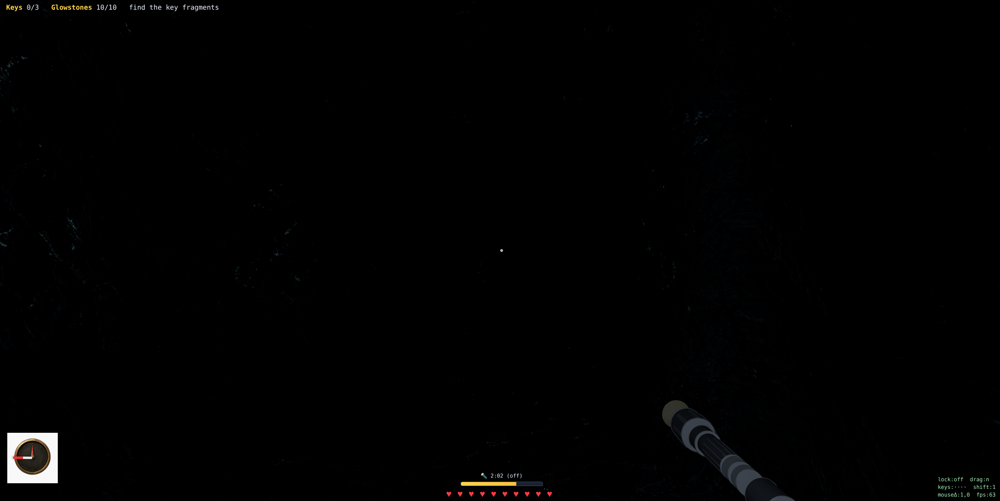

# Escape the Cave — 컴퓨터그래픽스 기말 과제 리포트

> 빛이 곧 생존 자원이자 위험이 되는 1인칭 절차적 복셀 동굴 탈출 게임
> 제작: __<이름>__
> 게임 링크: __<배포 URL>__
> 코드: __<GitHub URL>__
> 슬라이드 PDF: __<PDF 링크>__

---

## 1. 기획 — 출처와 핵심 아이디어

### 핵심 아이디어

무너진 동굴에 갇힌 탐험가가 **빛을 관리하며** 열쇠 조각을 모아 탈출하는 서바이벌이다.
이 게임의 중심 메커닉은 **"빛"** 이며, 단순히 시야를 밝히는 도구가 아니라 다음 세 가지를 동시에 결정한다.

- **시야** — 어두운 동굴에서 길을 찾으려면 빛이 필요하다.
- **간접광(GI)** — 글로우스톤을 놓으면 벽에 반사된 빛이 **모퉁이 너머까지** 퍼져 영구적인 안전 통로를 만든다.
- **위험** — 고블린은 어둠 속에 숨어 있다가 **손전등 빛에 이끌려** 다가온다. 빛을 켜면 멀리 보이지만 적을 부른다.

즉 "빛을 켤 것인가, 끌 것인가"가 매 순간의 의사결정이 되도록 설계했다.

### 영감 및 레퍼런스

- **Minecraft** — 복셀 동굴, 좀비 신음 사운드, 하트 10칸 체력 UI, 글로우스톤(발광 블록) 개념.
- **호러 서바이벌(Amnesia, Outlast 등)** — 손전등 배터리 자원 관리와 어둠 속 긴장감.
- **실시간 전역조명 기법(DDGI / Light Propagation Volumes)** — 동적 광원의 간접광을 실시간에 근사하는 접근.

### 차별점

- **절차적 복셀 동굴 + 실시간 간접광(GI)** 이 게임플레이에 직접 연결된다. 글로우스톤을 놓는 즉시 GI가 재계산되어 빛이 코너를 돌아 퍼지고, 그 빛 자체가 "안전한 길"이 된다.
- **빛이 적을 유인하는 역설** — 일반적인 호러 게임이 "빛 = 안전"인 것과 반대로, 손전등은 양날의 검이다.


*그림 1. 글로우스톤이 만든 간접광이 통로를 밝히는 장면. (시작 화면 캡처로 교체 권장 — 아래 "채워야 할 부분" 참고)*

---

## 2. 게임 규칙과 조작

### 목표

- 동굴을 탐험하며 흩어진 **열쇠 조각 3개**를 모은다.
- 열쇠를 모두 모으면 열리는 **출구**까지 생존해 탈출한다.

### 승리 조건

- 열쇠 조각 3개를 모두 획득한 뒤 출구 지점에 도달한다.


*그림 2. 승리(탈출) 화면.*

### 실패 조건

- 고블린의 공격으로 **체력(하트 10칸 = 20HP)** 이 0이 되면 사망한다.


*그림 3. 패배(사망) 화면.*

### 자원 시스템

| 자원 | 설명 |
|---|---|
| 손전등 | 시선 방향을 비추는 스포트라이트. **배터리 3분(180초)**, 켜져 있을 때만 소모. 다 닳으면 켜지지 않는다. 멀리 보이지만 고블린을 유인한다. |
| 글로우스톤 | **10개 한정**, 우클릭으로 설치(회수 불가). 영구 발광 + **간접광(GI)** 을 발생시켜 모퉁이 너머까지 밝힌다. |
| 열쇠 조각 | 3개. 동굴 곳곳에 분산. 조준 후 F로 획득. |
| 체력 | 하트 10칸(20HP). 피격 시 3 감소, **30초마다 1칸(2HP) 자동 회복**. |

### 적 시스템

| 적 | 특징 |
|---|---|
| 고블린 | 평소 어둠 속에 정지해 보이지 않음. **손전등 빔에 들어오면**(인식 범위 45) 플레이어 쪽으로 **이동 속도 1/4(1.5)** 로 추격. 접촉 시 1초마다 3 피해. 손전등을 끄거나 빔 밖이면 멈춘다. |

### 조작

| 입력 | 동작 |
|---|---|
| WASD | 이동 |
| Shift + W | 달리기 |
| Space | 점프 |
| 마우스 | 시선 (포인터 잠금, 실패 시 드래그 폴백) |
| 좌클릭 | 손전등 On/Off |
| 우클릭 | 글로우스톤 설치 |
| F | 열쇠 획득(조준 시) |
| M | 맵 보기(지나온 경로) |
| Esc | 마우스 잠금 해제 |


*그림 4. 손전등으로 열쇠 조각을 비추고 F로 획득. 조준 시 크로스헤어가 강조된다.*

---

## 3. 시스템 구조

### 전체 구조

빌드 타임에 **절차적 생성기**로 동굴을 한 번 생성해 `cave.json`(복셀 데이터 + SDF)으로 고정하고,
**런타임(게임)은 생성기를 돌리지 않고 `cave.json`만 로드**한다(결정론·안전·로딩 경량).

### 로직 레이어

- **caveGenerator.js** — three.js 비의존 순수 로직. 방+복도 carving으로 걷기 가능 동굴 생성, SDF(거리장) 베이크, 결정론 PRNG(mulberry32).
- **caveIO.js** — `cave.json` 직렬화/역직렬화(데이터 base64).
- **game.js** — 게임 런타임: 로드, 플레이어/충돌, 적 AI, 자원, GI, 렌더 루프.

### 렌더링 레이어

- **Surface Nets** — 복셀/SDF에서 매끈한 표면 메시 생성(내부 면 컬링).
- **Triplanar PBR** — UV 없는 메시에 Rock035 PBR(albedo/normal/roughness)를 월드 3축 투영.
- **조명** — 환경광 + 손전등(SpotLight) + 글로우스톤(PointLight) + **베이크된 간접광(GI)**.

### 시스템 파이프라인

```text
[빌드 타임]  caveGenerator.js  →  cave.json (복셀 + SDF)

[런타임]
  입력 (WASD / 마우스 / 클릭)
        ↓
  게임 로직 (이동·BVH 충돌 / 고블린 AI / 자원·체력)
        ↓
  GI 계산 (글로우스톤 → 복셀 flood 전파 → 버텍스 베이크)   ※ 설치 시에만
        ↓
  렌더링 (Surface Nets 메시 + Triplanar PBR + 직접광 + 간접광)
        ↓
  출력 (WebGL2 캔버스 + HUD)
```

### 핵심 코드 — 런타임은 cave.json만 로드

```js
// game.js — 생성기를 돌리지 않고 고정된 맵을 로드 (결정론)
const res = await fetch("./cave.json", { cache: "no-store" });
buildWorld(loadCaveFromJSON(await res.json()));
```

---

## 4. [강의 L4] Lighting & Shading

### 사용한 조명 모델

three.js `MeshStandardMaterial`의 **물리 기반 셰이딩(PBR, GGX/Cook–Torrance)** 을 사용한다.
표면은 albedo·roughness·normal을 triplanar로 샘플하고, 아래 광원들의 기여를 합산한다.

- **환경광** — `AmbientLight` + `HemisphereLight` (동굴을 완전한 암흑으로 두지 않는 최소 기저광).
- **손전등** — 카메라에 부착된 `SpotLight`(45° 콘, 사거리 100). 시선 방향을 비추는 직접광.
- **글로우스톤** — 설치 시 `PointLight`(사거리 55).

### Direct Lighting

손전등·글로우스톤이 표면에 직접 닿는 빛은 PBR 직접광으로 계산된다.
손전등은 **배터리로 제한된 자원**이므로 직접광 자체가 게임 메커닉이 된다.

### Shadow

본 프로젝트는 **실시간 그림자 맵(shadow map)을 사용하지 않는다.**
대신 다음으로 음영/가림을 표현한다.

- **버텍스 AO** — 표면 메시 각 정점에서 주변 복셀 밀집도로 ambient occlusion을 계산해 크레비스를 어둡게.
- **간접광(GI) 가림** — 빛이 벽으로 막힌 복셀에는 전파되지 않으므로 자연스러운 그림자 영역이 생긴다(5장).

### 게임 플레이와의 연관성

빛은 곧 **가시성·안전·적 유인**을 동시에 결정한다. 손전등을 켜면 멀리 보이지만 배터리가 닳고 고블린이 다가온다.

| Before (손전등 OFF) | After (손전등 ON) |
|---|---|
|  |  |

*그림 5. 손전등 직접광 비교 — 같은 위치에서 손전등을 켜기 전/후.*

---

## 5. [강의 L8] Global Illumination

### 사용 기법

**복셀 기반 확산 전역조명(Light Propagation Volume 계열) — 동적 갱신 + 버텍스 베이크.**
글로우스톤이라는 동적 광원의 **간접광(벽 반사)** 을 실시간에 근사한다.

> 참고: 본 구현은 정통 DDGI(probe ray-tracing)나 SurfelGI가 아니라, WebGL2(compute 셰이더 불가)에서 가볍게 동작하도록 만든 **복셀 광전파(LPV) 방식의 확산 GI**다. 채점 기준이 DDGI/SurfelGI를 명시하므로, 이 차이를 어떻게 서술할지는 "채워야 할 부분"에 정리해 두었다.

### 기본 원리

1. 동굴을 **3복셀 단위의 거친 조도 격자**로 나눈다(약 43×22×43).
2. 각 글로우스톤 위치의 셀에 RGB 광량을 주입한다.
3. **열린(공기) 셀을 따라 빛을 flood 전파**한다 — 매 반복마다 이웃 열린 셀의 최대값 × 감쇠(0.8)를 취하는 방식으로 9회 반복. 벽(solid)에서는 전파가 막히므로 빛은 **복도를 따라 모퉁이를 돌아** 퍼진다.
4. 완성된 조도 격자를 **동굴 메시의 각 정점(`aGI` 어트리뷰트)** 에 샘플해 베이크하고, 셰이더에서 **간접광으로 더한다**.

광원이 정적(글로우스톤은 설치 후 고정)이라, **설치할 때만 재계산**하므로 매 프레임 비용이 0이다(웹 채점 환경에서 안전).

### 게임에서의 활용

글로우스톤의 간접광이 만든 밝은 영역 = **안전하게 지나갈 수 있는 길**이다. 직접 보이지 않는 코너 너머까지 빛을 보내 동굴을 "개척"하는 것이 핵심 재미다.

| GI OFF (글로우스톤 없음) | GI ON (글로우스톤 설치) |
|---|---|
|  |  |

*그림 6. 글로우스톤 설치 전/후 간접광 비교. 오른쪽은 빛이 벽에 반사돼 주변과 모퉁이 너머까지 퍼진다. (OFF 컷은 동일 위치에서 글로우스톤 없이 재촬영 권장)*

### 구현 상세

```js
// 글로우스톤 → 열린 복셀로 빛 전파(모퉁이 너머까지) → 버텍스 베이크
function computeGI() {
  for (let i = 0; i < n; i++) { /* 기저 환경광 */ }
  for (const tr of torches)    /* 글로우스톤 셀에 광량 주입 */;
  for (let it = 0; it < 9; it++) {           // 9회 전파
    for (각 열린 셀) for (6-이웃 중 열린 셀)  // 벽이면 막힘
      v = max(v, neighbor * 0.8);            // 감쇠하며 확산
  }
  bakeGIToVertices();                        // aGI 어트리뷰트로 베이크
}
```
```glsl
// 락 머티리얼 프래그먼트 — 베이크된 간접광을 알베도로 틴트해 더함
totalEmissiveRadiance += vGI * diffuseColor.rgb * 2.0;
```

### 선택 이유

- WebGL2에는 compute 셰이더가 없어 GPU 프로브 ray-tracing(정통 DDGI)이 무겁고 구현 리스크가 크다.
- 광원이 정적이므로 **이벤트 기반(설치 시) 재계산**으로 런타임 비용을 0에 가깝게 만들 수 있어, 미지의 채점 PC에서도 안전하게 구동된다.
- 복셀 flood 방식이 "모퉁이 너머 간접광"이라는 목표 시각효과를 직관적으로 달성한다.

### 한계점

- 손전등(동적 이동 광원)의 간접광은 아직 미적용(글로우스톤만 GI 광원).
- 격자가 거칠어(3복셀) 간접광이 다소 뭉툭하다.
- 단일 바운스 근사(다중 반사 없음).

---

## 6. [강의 L5] Texture & Material

### 사용한 텍스처

| Asset | 설명 |
|---|---|
| Rock035 — Color | 석회암/암석 albedo (ambientCG, CC0) |
| Rock035 — Normal(GL) | 표면 요철 노멀맵 (OpenGL 규약) |
| Rock035 — Roughness | 거칠기 맵 |
| compass.png | 나침반 다이얼 HUD |

### UV Mapping

Surface Nets로 생성한 매끈한 동굴 메시는 **UV 좌표가 없다.** 따라서 **Triplanar Projection** 을 사용한다 — 월드 좌표를 X/Y/Z 세 평면에 투영해 샘플하고, 면 법선 가중치로 블렌드한다(이음매 없음).

### Material

`MeshStandardMaterial`(metalness 0)에 `onBeforeCompile`로 triplanar 샘플링을 주입한다. 어두운 암석이라 albedo를 약간 밝게 보정한다.

### Normal Map

노멀맵도 UV가 없으므로 **triplanar whiteout 블렌드**로 3축 노멀을 합성해 월드→뷰 공간 노멀로 변환한다. 이로써 평면 메시에 미세 요철 음영이 생긴다.

| Base Color | Normal (GL) |
|---|---|
|  |  |

*그림 7. Rock035 PBR 텍스처(ambientCG, CC0).*


*그림 8. 손전등을 받은 동굴 벽 — triplanar PBR + 노멀맵 + 버텍스 AO가 적용된 모습.*

---

## 7. [강의 L6] Animation

### 캐릭터

적(고블린)은 **Mixamo 스켈레탈 캐릭터**(`Walking.fbx`)를 `FBXLoader`로 불러와 사용한다.
여러 마리를 위해 **SkeletonUtils.clone** 으로 스킨드 메시를 정확히 복제한다.


*그림 9. Mixamo 고블린 캐릭터(스켈레탈 리그 + 걷기 애니메이션).*

### 애니메이션

- **Walking** — `AnimationMixer`로 재생.
- 자체 발광(emissive)을 제거해 **빛을 받을 때만 보이도록** 처리(어둠 속 잠복).

### 상태 전환

```text
정지(애니메이션 일시정지)
    ↓  손전등 빔에 들어옴 (aggro)
이동(Walk 재생) ── 실제로 좌표가 움직일 때만 클립 재생
    ↓  접촉
공격(접촉 1초마다 3 피해)
```

> 멈췄을 때 제자리 걷기를 막기 위해, **실제로 이동한 프레임에만** 애니메이션을 재생하고 아니면 `action.paused = true`로 정지한다.

---

## 8. AI 및 게임 시스템

### 적 AI

#### 탐지

- **시각(손전등 빔)** — 플레이어 시선 콘 안 + 인식 범위(45) 안에 들어오면 활성화. *(현재 핵심 탐지 방식)*
- 청각/발소리 탐지 — 미구현(향후 계획).

#### 상태 머신

```text
Idle (정지·비가시)
  ↓ 손전등 빔이 닿음
Chase (플레이어의 1/4 속도로 추격, 복셀 충돌·바닥 스냅)
  ↓ 접촉(거리 < 1.4)
Attack (1초마다 3 피해, 화면 흔들림 + 피격음)
  ↑ 손전등 끄거나 빔 밖 → Idle
```

### 아이템

| 아이템 | 역할 |
|---|---|
| 글로우스톤 | 영구 광원 + 간접광(GI). 안전 통로/길 표시. |
| 열쇠 조각 | 출구 잠금 해제(3개). |

### 환경 요소

| 요소 | 역할 |
|---|---|
| 물(Water) | 동굴 저지대의 얕은 물웅덩이(통행 가능). |
| 발광 버섯/광석 | 동굴 표면 장식(생성기 단계). |


*그림 10. 손전등 빛이 닿으면 드러나는 고블린(어둠 속에서는 보이지 않음).*

---

## 9. 레벨 디자인

### 전체 구조

절차적으로 생성된 **방(room) + 복도(corridor)** 동굴(128×64×128 복셀, 방 12개 + 추가 루프 5).

```text
시작(spawn)
  ├─ 방/복도 네트워크 (열쇠 조각 3개가 BFS 거리로 멀리 분산)
  └─ 출구 (입구에서 보행 그래프상 가장 먼 지점)
```

### 진행 구조

| 구역 | 목적 | 핵심 경험 |
|---|---|---|
| 시작 방 | 안전 거점 | 조작·자원 적응 |
| 동굴 본체 | 탐험·열쇠 수집 | 빛 관리, 글로우스톤으로 길 개척, 고블린 회피 |
| 출구 | 탈출 | 모은 열쇠로 잠금 해제 후 귀환 |


*그림 11. M 키로 보는 맵 — 지나온 경로(파랑)와 현재 위치/방향(노랑)만 표시되는 fog-of-war.*

---

## 10. 최적화

### 사용 기법

- **three-mesh-bvh** — 동굴 충돌 메시에 BVH를 구축해 캡슐-충돌 + 바닥 레이캐스트를 가속.
- **Surface Nets 내부 컬링** — 열린 공간에 면한 표면만 생성(내부 복셀 제외).
- **이벤트 기반 GI** — 간접광을 글로우스톤 설치 시에만 재계산(매 프레임 비용 0).
- **사전 베이크(cave.json)** — 런타임에 생성기를 돌리지 않음(결정론 + 로딩 경량).
- **렌더 비용 캡** — `pixelRatio` 제한, 텍스처 이방성 4로 제한, 동적 라이트 개수 관리.

### 성능 측정

| 항목 | 결과 |
|---|---|
| FPS | __<측정 필요>__ |
| 표면 삼각형 | 약 5만 (Surface Nets, 128³ 동굴) |
| Draw Call | __<측정 필요, 소수>__ |

### 분석

정적 동굴 + 이벤트 기반 GI 덕분에 매 프레임 비용이 낮고, 충돌은 BVH로 sub-ms 수준이다. (정확한 FPS/드로우콜 수치는 채점 PC 기준으로 측정 후 기입.)

---

## 11. 검증

### 테스트 항목

- **결정론** — 같은 seed → 항상 동일한 동굴(`cave.json` == 재생성 결과, 바이트 일치).
- **보행 가능성 보장** — 생성기가 walkable 컴포넌트를 보장(미달 시 더 깎아 재시도).
- **풀이 가능성(solvable)** — 입구·출구·모든 열쇠가 하나의 보행 컴포넌트에 속함(BFS 검증).

### 결과

커밋된 맵(seed 1): 128×64×128, walkable 3722칸, SDF 베이크 포함, 입구→출구→열쇠 전부 도달 가능(Solvable: YES). 다수 seed에서 동일 검증 통과.

### 재현 방법

```bash
# 빌드 도구 없음 — 정적 서버로 열기만 하면 됨
python3 -m http.server 8000
# 브라우저에서 http://localhost:8000/game.html  (게임)
#               http://localhost:8000/generator.html (생성기/검증 뷰어)

# 맵 재생성(선택)
node gen.mjs
```

---

## 12. 한계와 향후 계획

### 현재 한계

- **GI 광원이 글로우스톤만** — 손전등(이동 광원)의 간접광은 미적용.
- **그림자 맵 미사용** — 음영은 AO + GI 가림으로만 표현.
- **애니메이션이 걷기 1종** — Idle/Attack 클립 미적용(멈추면 정지 프레임).
- **정통 DDGI/SurfelGI가 아님** — 복셀 광전파(LPV) 근사.

### 개발 과정의 디버깅 사례

오일러 카메라의 **짐벌 락(gimbal lock)** 으로 위/아래를 볼 때 화면이 Y축으로 폭주하던 문제를 겪었고, 입력 방식 교체 + pitch clamp + YXZ(roll 0)로 해결했다.


*그림 12. 초기 카메라의 무한 회전(짐벌 락) 현상 — 이후 해결.*

### 향후 개선

- 손전등 기반 간접광(저빈도 갱신) 추가.
- 고블린 Idle/Attack 애니메이션 + 청각 탐지.
- 손전등 GLB 업그레이드, 더 다양한 적/구역.

---

## 13. 빌드 · 실행 · 출처

### 빌드 · 실행

```bash
# 빌드 도구·번들러 없음 (plain ES modules + 정적 서버)
python3 -m http.server 8000
# 게임:        http://localhost:8000/game.html
# 생성기 뷰어:  http://localhost:8000/generator.html
```

### 참고 자료

- three.js (WebGL2 렌더링) — https://threejs.org
- three-mesh-bvh (충돌 가속) — https://github.com/gkjohnson/three-mesh-bvh
- Naive Surface Nets (Mikola Lysenko) — 등위면 메싱
- Light Propagation Volumes / DDGI — 실시간 확산 GI 기법
- mulberry32 — 시드 가능 결정론 PRNG

### 크레딧

- 제작: __<이름>__
- 라이브러리: three.js, three-mesh-bvh, lil-gui(생성기 도구)
- 에셋:
  - 바위 텍스처 — **Rock035, ambientCG (CC0)**
  - 고블린 캐릭터/애니메이션 — **Mixamo (Adobe)**
  - 손전등 모델 — `flashlight_tactical_mesh.glb` (AI(GPT)로 생성)
  - 나침반 다이얼 — `compass.png` (__<출처 표기>__)

---

## 부록 — 내가 채워야 할 부분 (작성자 확인용)

1. **머리말**: 이름, 게임 배포 URL, GitHub URL, 슬라이드 PDF 링크.
2. **GI 서술 방향(중요)**: 채점 기준은 "DDGI 또는 SurfelGI"인데, 본 구현은 **복셀 광전파(LPV) 방식의 확산 GI**다. (a) 이대로 정직하게 LPV로 서술할지, (b) "동적 확산 GI(DDGI의 경량 변형)"로 표현할지, (c) 시간이 되면 정통 프로브 DDGI로 보강할지 결정 필요.
3. **성능 수치**: FPS, Draw Call (채점 PC 기준 측정 후 10장 표에 기입).
4. **스크린샷 보강(권장)**:
   - 시작/타이틀 화면 캡처(그림 1 교체).
   - GI OFF 컷(그림 6 왼쪽) — 글로우스톤 **없이** 동일 위치 재촬영.
5. **에셋 출처 표기**: 손전등 GLB, compass.png의 정확한 출처/라이선스.
6. **레퍼런스/크레딧**: 추가로 참고한 자료나 본인 표기 보완.
