# Escape the Cave — 컴퓨터그래픽스 기말 과제 리포트

> 빛이 곧 생존 자원이자 위험이 되는 1인칭 절차적 복셀 동굴 탈출 게임
> 게임 링크: https://i1uvmango.github.io/escape_the_cave_computerGraphics/
> 코드: https://github.com/i1uvmango/escape_the_cave_computerGraphics


---

## 1. 기획 — 출처와 핵심 아이디어

### 핵심 아이디어

무너진 동굴에 갇힌 탐험가가 **빛을 관리하며** 열쇠 조각을 모아 탈출하는 서바이벌이다.
이 게임의 중심 메커닉은 **"빛"** 이며, 단순히 시야를 밝히는 도구가 아니라 다음 세 가지를 동시에 결정한다.

- **시야** — 어두운 동굴에서 길을 찾으려면 빛이 필요하다.
- **간접광(GI)** — 글로우스톤을 놓으면 벽에 반사된 빛이 **모퉁이 너머까지** 퍼져 영구적인 안전 통로를 만든다.
- **위험** — 고블린은 어둠 속에 숨어 있다가 **손전등 빛에 이끌려** 다가온다. 빛을 켜면 멀리 보이지만 적을 부른다.

즉 "빛을 켤 것인가, 끌 것인가"가 매 순간의 의사결정이 되도록 설계했다.

### 영감 및 레퍼런스

- **Minecraft** — 복셀 동굴, 좀비 신음 사운드, 하트 10칸 체력 UI, 글로우스톤(발광 블록) 개념.
- **호러 서바이벌(Amnesia, Outlast 등)** — 손전등 배터리 자원 관리와 어둠 속 긴장감.
- **실시간 전역조명 기법(DDGI / Light Propagation Volumes)** — 동적 광원의 간접광을 실시간에 근사하는 접근.

### 차별점

- **절차적 복셀 동굴 + 실시간 간접광(GI)** 이 게임플레이에 직접 연결된다. 글로우스톤을 놓는 즉시 GI가 재계산되어 빛이 코너를 돌아 퍼지고, 그 빛 자체가 "안전한 길"이 된다.
- **빛이 적을 유인하는 역설** — 일반적인 호러 게임이 "빛 = 안전"인 것과 반대로, 손전등은 양날의 검이다.
- **빛의 경제(전략 자원)** — 글로우스톤은 **10개뿐**이고 모두 소진하면 **고블린이 깨어나 공격**한다. 어디를 밝힐지, 자원을 언제 쓸지가 곧 생존 전략이 된다.


*그림 1. 글로우스톤이 만든 간접광이 통로를 밝히는 장면.*

| 게임플레이 ① | 게임플레이 ② |
|---|---|
|  |  |

*그림 1-1. 실제 게임플레이 — 손전등으로 어둠을 밝히며 열쇠 조각을 찾고, 글로우스톤으로 안전한 길을 개척한다.*

---

## 2. 게임 규칙과 조작

### 목표

- 동굴을 탐험하며 흩어진 **열쇠 조각 3개**를 모은다.
- 열쇠를 모두 모으면 열리는 **출구**까지 생존해 탈출한다.

### 승리 조건

- 열쇠 조각 3개를 모두 획득한 뒤 출구 지점에 도달한다.

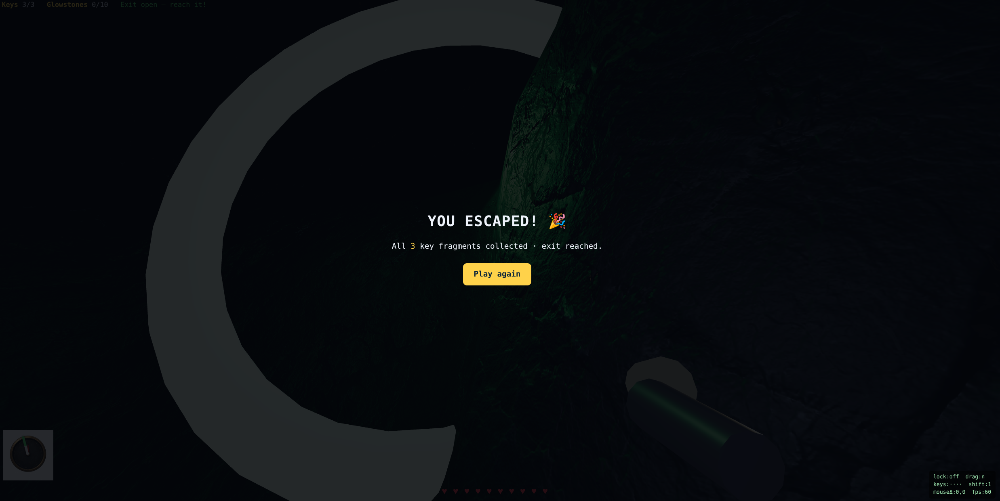

*그림 2. 승리(탈출) 화면.*

### 실패 조건

- 고블린의 공격으로 **체력(하트 10칸 = 20HP)** 이 0이 되면 사망한다.

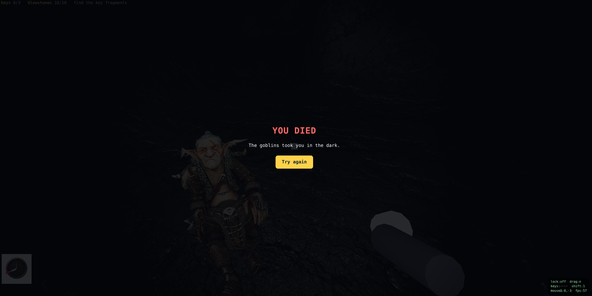

*그림 3. 패배(사망) 화면.*

### 자원 시스템

| 자원 | 설명 |
|---|---|
| 손전등 | 시선 방향을 비추는 스포트라이트. **배터리 3분(180초)**, 켜져 있을 때만 소모. 다 닳으면 켜지지 않는다. 멀리 보이지만 고블린을 유인한다. |
| 글로우스톤 | **10개 한정**, 우클릭으로 설치(회수 불가). 영구 발광 + **간접광(GI)** 을 발생시켜 모퉁이 너머까지 밝힌다. **10개를 모두 소진하면 고블린이 깨어나 공격을 시작**하므로 전략적으로 써야 한다. |
| 열쇠 조각 | 3개. 동굴 곳곳에 분산. 조준 후 F로 획득. |
| 체력 | 하트 10칸(20HP). 피격 시 3 감소, **30초마다 1칸(2HP) 자동 회복**. |

### 적 시스템

| 적 | 특징 |
|---|---|
| 고블린 | 평소 어둠 속에 정지해 보이지 않음. **손전등 빔에 들어오면**(인식 범위 45) 플레이어 쪽으로 **이동 속도 1/4(1.5)** 로 추격. 접촉 시 1초마다 3 피해. 손전등을 끄거나 빔 밖이면 멈춘다. **단, 글로우스톤을 모두 소진하면 손전등 여부와 무관하게 모든 고블린이 깨어나 추격·공격한다.** |

### 조작

| 입력 | 동작 |
|---|---|
| WASD | 이동 |
| Shift + W | 달리기 |
| Space | 점프 |
| 마우스 | 시선 (포인터 잠금, 실패 시 드래그 폴백) |
| 좌클릭 | 손전등 On/Off |
| 우클릭 | 글로우스톤 설치 |
| F | 열쇠 획득(조준 시) |
| M | 맵 보기(지나온 경로) |
| P | GI probe 격자 표시(디버그) |
| Esc | 마우스 잠금 해제 |


*그림 4. 손전등으로 열쇠 조각을 비추고 F로 획득. 조준 시 크로스헤어가 강조된다.*

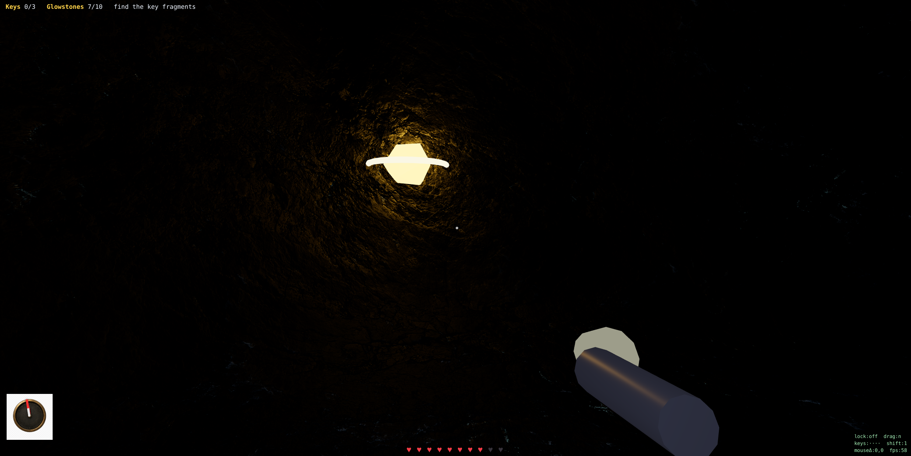

*그림 4-1. 동굴 곳곳에 흩어진 회전하는 열쇠 조각. 3개를 모두 모으면 출구가 초록색으로 열린다.*

---

## 3. 시스템 구조

### 전체 구조

빌드 타임에 **절차적 생성기**로 동굴을 한 번 생성해 `cave.json`(복셀 데이터 + SDF)으로 고정하고,
**런타임(게임)은 생성기를 돌리지 않고 `cave.json`만 로드**한다(결정론·안전·로딩 경량).

### 로직 레이어

- **caveGenerator.js** — three.js 비의존 순수 로직. 방+복도 carving으로 걷기 가능 동굴 생성, SDF(거리장) 베이크, 결정론 PRNG(mulberry32).
- **caveIO.js** — `cave.json` 직렬화/역직렬화(데이터 base64).
- **game.js** — 게임 런타임: 로드, 플레이어/충돌, 적 AI, 자원, GI, 렌더 루프.

### 렌더링 레이어

- **Surface Nets** — 복셀/SDF에서 매끈한 표면 메시 생성(내부 면 컬링).
- **Triplanar PBR** — UV 없는 메시에 Rock035 PBR(albedo/normal/roughness)를 월드 3축 투영.
- **조명** — 환경광 + 손전등(SpotLight) + 글로우스톤(PointLight) + **베이크된 간접광(GI)**.

### 시스템 파이프라인

```text
[빌드 타임]  caveGenerator.js  →  cave.json (복셀 + SDF)

[런타임]
  입력 (WASD / 마우스 / 클릭)
        ↓
  게임 로직 (이동·BVH 충돌 / 고블린 AI / 자원·체력)
        ↓
  DDGI (프로브 → BVH 광선추적 → 시간적 누적 → 버텍스 베이크)   ※ 글로우스톤 설치 시 버스트만
        ↓
  렌더링 (Surface Nets 메시 + Triplanar PBR + 직접광 + 간접광)
        ↓
  출력 (WebGL2 캔버스 + HUD)
```

### 핵심 코드 — 런타임은 cave.json만 로드

```js
// game.js — 생성기를 돌리지 않고 고정된 맵을 로드 (결정론)
const res = await fetch("./cave.json", { cache: "no-store" });
buildWorld(loadCaveFromJSON(await res.json()));
```

---

## 4. [강의 L4] Lighting & Shading

### 사용한 조명 모델

three.js `MeshStandardMaterial`의 **물리 기반 셰이딩(PBR, GGX/Cook–Torrance)** 을 사용한다.
표면은 albedo·roughness·normal을 triplanar로 샘플하고, 아래 광원들의 기여를 합산한다.

- **환경광** — `AmbientLight` + `HemisphereLight` (동굴을 완전한 암흑으로 두지 않는 최소 기저광).
- **손전등** — 카메라에 부착된 `SpotLight`(45° 콘, 사거리 100). 시선 방향을 비추는 직접광.
- **글로우스톤** — 설치 시 `PointLight`(사거리 55).

### 광원의 종류 (강의 L4: Light Sources)

강의에서 다룬 광원 분류(point / spot / directional / hemisphere)에 맞춰, 본 게임은 **여러 종류의 광원을 모두 사용**한다.

| 광원 종류 | 게임에서의 용도 |
|---|---|
| **SpotLight** | 손전등 — 45° 콘, 사거리 100, 감쇠 0.8 |
| **PointLight** | 글로우스톤(사거리 55) · 출구 표식 · 헤드램프 |
| **HemisphereLight** | 천장/바닥 색이 다른 약한 환경광 |
| **AmbientLight** | 균일 기저광(동굴을 완전 암흑으로 두지 않음) |

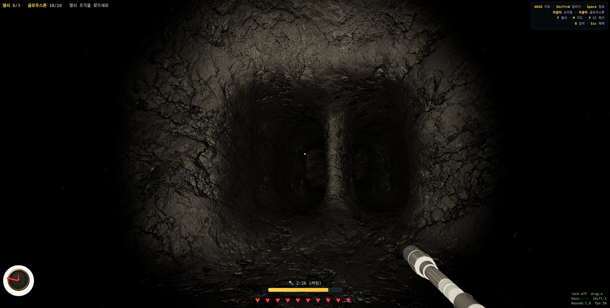

*그림 5-1. 손전등(SpotLight)만으로 비춘 통로 — 45° 콘과 거리 감쇠가 드러난다. 글로우스톤(PointLight)·환경광 예시는 Emissive/5장 GI 그림 참고.*

### Direct Lighting

손전등·글로우스톤이 표면에 직접 닿는 빛은 PBR 직접광으로 계산된다.
손전등은 **배터리로 제한된 자원**이므로 직접광 자체가 게임 메커닉이 된다.

### Emissive(자기 발광)와 렌더링 방정식 (강의 L4)

렌더링 방정식 `Lo = Le + ∫ fr·Li·(ωi·n) dωi` 에서 **Le(자기 발광)** 항에 해당하는 요소가 게임에 있다.

- **글로우스톤 블록 · 출구 표식 · 열쇠 조각**은 `emissive` 머티리얼로 스스로 빛난다(주변 빛이 없어도 보임).
- 5장의 **간접광(GI)** 역시 셰이더에서 `totalEmissiveRadiance`에 더해, 표면이 받은 간접광을 자기 발광처럼 출력한다.


*그림 5-2. 손전등 OFF 상태에서 **글로우스톤 블록이 스스로 빛나고(emissive)**, 그 빛이 동굴 표면에 **간접광(GI)** 으로 퍼진 모습. 블록은 의도적으로 무텍스처 발광체다.*

### Per-pixel 셰이딩과 거리 감쇠 (강의 L4)

- **Per-pixel(프래그먼트) 셰이딩** — three.js는 조명을 프래그먼트 단위로 계산한다(Flat/Gouraud가 아닌 Phong-shading 계열). Surface Nets의 매끈한 정점 노멀과 triplanar 노멀맵이 픽셀마다 보간되어 부드러운 음영·하이라이트가 생긴다.
- **거리 감쇠(Attenuation)** — 각 광원의 `distance`/`decay`로 거리에 따른 감쇠를 적용한다. 물리적으로 정확한 inverse-square라기보다는, **게임플레이 가시성을 위해 distance/decay를 조정한 경험적 감쇠**다(손전등 사거리 100·감쇠 0.8). 멀어질수록 어두워지는 것이 곧 "빛으로 길을 개척"하는 게임성과 직결된다.


*그림 5-3. 손전등을 복도에 비스듬히 비춘 컷 — 가까운 벽은 밝고 멀어질수록 어두워지는 **거리 감쇠(attenuation)** 가 보인다.*

### Shadow

캐릭터(플레이어·고블린)에 **실시간 그림자 맵**을 적용하되, 웹/저사양 환경의 비용을 고려해 **다음과 같이 강하게 제한**했다.

- **Nearest sampling(`BasicShadowMap`) + 그림자 광원 1개만** — 필터링 없는 가장 저렴한 그림자맵을 쓰고, 그림자를 던지는 광원은 **플레이어에서 가장 가까운 글로우스톤 1개**로 한정한다(가장 가까운 글로우스톤이 바뀔 때만 다시 바인딩).
- **캐스터는 동적 객체만** — 플레이어(인간 스켈레탈 메시)와 고블린만 `castShadow`, 거대한 동굴 메시(약 5만 삼각형)는 `receiveShadow`만 한다. 그림자 패스가 작은 동적 객체만 그리므로 비용이 작다.
- 플레이어 바디(인간 캐릭터)는 **shadow-only**(`colorWrite=false, depthWrite=false`)로 처리한다 — 1인칭 화면엔 보이지 않지만 **글로우스톤 방향으로 바닥/벽에 사람 형태 그림자**를 드리운다.

이와 별도로 **버텍스 AO**(복셀 밀집도 기반)와 **간접광(GI) 가림**(5장)이 동굴 표면의 음영을 보완한다.

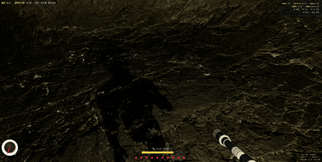

*그림 5-4. 1인칭에서 보이지 않는 인간 캐릭터(shadow-only)가 **가장 가까운 글로우스톤 방향으로 사람 형태 그림자**를 드리운다. 걸으면 그림자도 함께 걷는다.*

### 게임 플레이와의 연관성

빛은 곧 **가시성·안전·적 유인**을 동시에 결정한다. 손전등을 켜면 멀리 보이지만 배터리가 닳고 고블린이 다가온다.

| Before (손전등 OFF) | After (손전등 ON) |
|---|---|
|  | 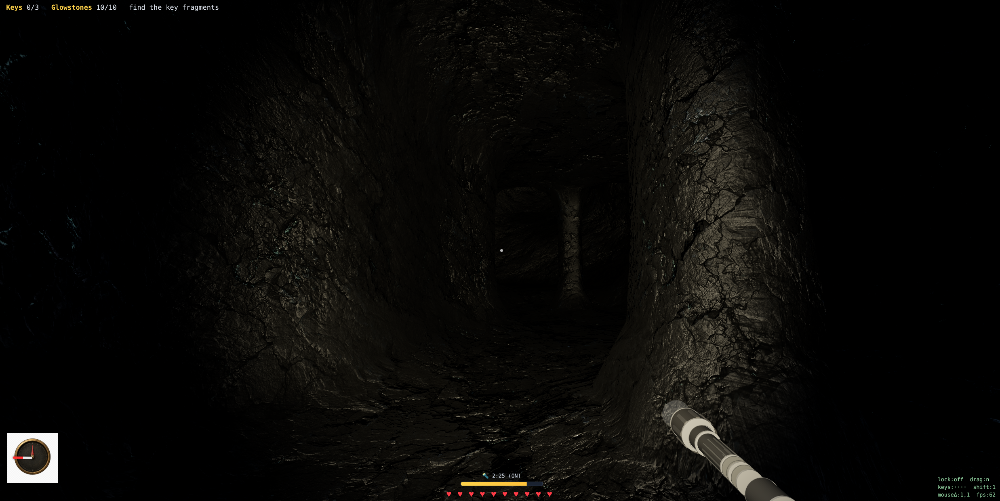 |

*그림 5-5. 손전등 직접광 비교 — 같은 위치에서 손전등을 켜기 전/후.*

---

## 5. [강의 L8] Global Illumination — Simplified Probe-based DDGI

### 사용 기법

> **본 프로젝트의 GI는 강의의 DDGI 파이프라인을 웹 환경에 맞게 단순화한 probe-based diffuse GI 근사다.** 정통 DDGI의 핵심 골격(프로브 격자·Fibonacci 광선·그림자 광선·시간적 누적)은 그대로 따르되, SH 저장·8프로브 보간·무한 바운스·픽셀 셰이더 샘플은 단순화했다(본 장 끝의 대응표 참고).

**probe 기반 확산 GI — 메시 + BVH 기반 probe 광선추적 + 시간적 누적.**
동굴 공간을 균일 격자의 **조도 프로브(irradiance probe)** 로 채우고, 각 프로브가 **BVH로 광선을 쏘아** 주변 표면의 **글로우스톤 직접광**을 모아 간접광을 추정한다.

> **DDGI의 광원은 글로우스톤(정적 광원)** 이다. 글로우스톤은 한번 놓이면 움직이지 않으므로, **설치 시에만 프로브 격자를 짧게 재계산(버스트)** 하고 평상시에는 프레임당 비용이 0이다.
>
> **손전등(이동 광원)은 DDGI로 처리하지 않는다.** 손전등은 매 프레임 움직여서 정통 DDGI(프로브 재추적)에 넣으면 비용이 과도하다. 대신 **실시간 렌더링을 위한 경량 트릭**을 쓴다 — 직접광(SpotLight)은 그대로 두고, **빔이 닿는 지점으로 광선 1개만 쏴서(레이캐스트) 그 주변 프로브 셀에 간접광을 주입(inject)** 한 뒤 정적 GI 위에 더한다. 즉 **이 부분은 DDGI가 아니라, DDGI의 프로브 격자를 빌려 쓰는 실시간 근사**다. 덕분에 손전등이 비춘 벽 주변이 은은하게 번지는 간접광을 **프레임당 레이캐스트 1회**의 비용으로 표현한다.

> 구조: `Mesh(Surface Nets) → three-mesh-bvh → DDGI`. 충돌용으로 이미 구축한 동굴 메시의 **BVH를 GI 광선추적에 그대로 재사용**한다. WebGL2에는 compute 셰이더가 없어 GPU 프로브 추적이 불가하므로, **CPU에서 설치 시 프로브를 프레임 분산(amortized)으로 갱신**하고 시간적 누적으로 수렴시킨다.

### 기본 원리

1. 동굴 공간을 **3복셀 간격의 균일 프로브 격자**로 채운다(약 43×22×43, 열린 공간 프로브 약 493개).
2. 각 프로브에서 **Fibonacci 구면 분포 24방향으로 광선을 발사**해 `three-mesh-bvh`로 표면 교차점을 찾는다(`firstHitOnly`).
3. 교차점마다 그 표면의 **글로우스톤 직접광**을 계산한다 — 사거리 내 글로우스톤에 대해 **그림자 광선(shadow ray)으로 가시성을 확인**하고, 거리 감쇠 × N·L을 적용한다. 벽에 막힌 빛은 그림자 광선에서 걸러지므로 **빛이 모퉁이를 돌아 퍼지는** 효과가 물리적으로 나온다.
4. 방향들의 평균을 프로브의 새 조도로 삼아 **이전 값과 시간적으로 누적(블렌딩)** 한다(노이즈 억제).
5. 완성된 프로브 조도를 **동굴 메시의 각 정점(`aGI` 어트리뷰트)** 에 (표면 노멀로 살짝 안쪽 프로브를 샘플해) 베이크하고, 셰이더에서 **간접광으로 더한다**.

글로우스톤이 **정적 광원**이므로, 설치할 때만 격자를 **약 40프레임 버스트(프레임당 1/8씩 갱신 × 시간적 누적)** 로 수렴시키고 그 뒤에는 재계산을 멈춘다 → **평상시 프레임당 GI 비용 0**. 정점→프로브 셀 매핑은 지형이 고정이므로 **로딩 시 1회만** 계산하고, 매 프레임 베이크는 갱신된 프로브 값을 그 매핑으로 옮기는 **단순 복사**다(전파 자체는 버스트에서 수행).

### 게임에서의 활용

글로우스톤의 간접광이 만든 밝은 영역 = **안전하게 지나갈 수 있는 길**이다. 직접 보이지 않는 코너 너머까지 빛을 보내 동굴을 "개척"하는 것이 핵심 재미다.

| GI OFF (글로우스톤 없음) | GI ON (글로우스톤 설치) |
|---|---|
|  |  |

*그림 6. 글로우스톤 설치 전/후 간접광 비교. 오른쪽은 빛이 벽에 반사돼 주변과 모퉁이 너머까지 퍼진다.*

### 구현 상세

```js
// DDGI: 프로브에서 BVH로 광선추적 → 글로우스톤 직접광 수집 → 시간적 누적 → 베이크
function gatherProbe(probe) {
  let irr = ambient;
  for (const dir of N방향) {                       // Fibonacci 구면 분포
    const hit = bvh.raycastFirst(probe.pos, dir);  // three-mesh-bvh
    if (!hit) continue;
    for (const g of 글로우스톤들) {                  // 히트 표면의 글로우스톤 직접광(손전등 제외)
      if (사거리밖 || N·L<=0) continue;
      if (occluded(hit, g)) continue;              // 그림자 광선(가시성)
      irr += g.color * 감쇠(dist) * N·L / N;
    }
  }
  probe.irr = lerp(probe.irr, irr, 0.5);           // 시간적 누적
}
// 글로우스톤 설치 시에만 버스트로 호출(약 40프레임), 평상시는 호출되지 않음
function ddgiTick() {
  for (slice of probes) gatherProbe(slice);        // 프레임당 격자의 1/8
  bakeGIToVertices();                              // 정점 aGI로 (정적 매핑) 복사
}
```glsl
// 락 머티리얼 프래그먼트 — 베이크된 간접광을 알베도로 틴트해 더함
totalEmissiveRadiance += vGI * diffuseColor.rgb * 2.0;
```

> 게임 내에서 **P 키**로 GI probe 격자를 표시할 수 있다 — 동굴 공간을 채운 probe(셀)들이 점으로 보이며, 글로우스톤 근처일수록 밝게 빛난다.

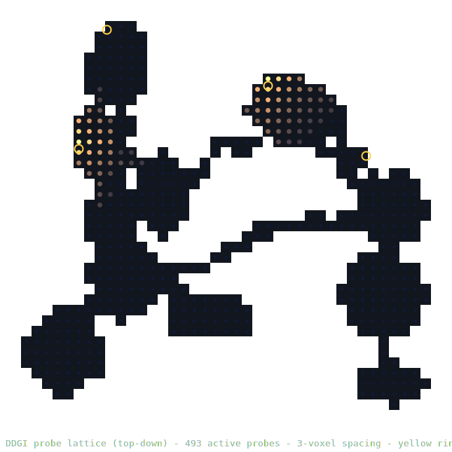

*그림 6-2. DDGI 방식의 probe 격자 배치(탑다운). **3복셀 간격의 균일 격자**에서 동굴의 열린 공간에 놓인 probe(약 493개)만 활성화된다. 글로우스톤(노란 링) 주변 probe가 밝고, 빛이 복도를 따라 인접 probe로 전파되며 모퉁이를 돈다. 벽 안쪽 셀은 비활성으로 표시되지 않는다.*

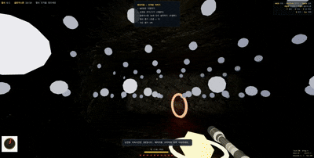

*그림 6-3. 인게임 실시간 GI(P 키 probe 시각화) — 글로우스톤을 설치하면 즉시(버스트) 간접광 격자가 재계산되어 빛이 주변 probe로 퍼진다.*

### 선택 이유

- **충돌용 BVH 재사용** — 이미 동굴 메시에 구축한 `three-mesh-bvh`를 GI 광선추적에 그대로 활용해, 별도 가속 구조 없이 프로브 레이트레이싱을 구현한다.
- **정적 광원 + 버스트 갱신** — 글로우스톤은 움직이지 않으므로 설치 시에만 프레임 분산 버스트로 수렴시키고 평상시 GI 비용은 0이다.
- **이동 광원의 경량 근사** — 손전등은 정통 DDGI(매 프레임 프로브 재추적)에 넣으면 비싸므로, **DDGI가 아닌 실시간 트릭**(빔 도달 지점 1회 레이캐스트 → 주변 프로브에 간접광 주입)으로 프레임당 거의 무비용에 처리한다.
- **그림자 광선 기반 가시성** — flood 근사와 달리 빛이 벽에 막히는지를 실제 광선으로 판정하므로 광 누출이 적고 모퉁이 간접광이 물리적으로 맞다.

### 한계점

- CPU 광선추적이라 프로브/광선 수에 비례해 비용이 들며, 매우 약한 PC에서는 갱신 비율을 더 낮춰야 할 수 있다.
- 격자가 거칠어(3복셀) 간접광이 다소 뭉툭하다.
- 단일 바운스 근사(다중 반사 없음) — 표면의 직접광만 모으고 간접광의 재바운스는 누적된 프로브를 통해 간접적으로만 반영된다.

### 강의 DDGI 파이프라인과의 대응 (강의 L8)

강의의 정통 DDGI 단계와 본 구현을 1:1로 비교하면 다음과 같다. **공통점은 그대로 따랐고, 비용 문제로 단순화한 부분은 솔직히 명시**한다.

| 강의 DDGI 단계 | 본 게임 구현 | 일치/단순화 |
|---|---|---|
| 균일 **프로브 격자** | 3복셀 간격 격자(동굴 공간 약 493개) | 일치 |
| **Spherical Fibonacci** 광선 분포 | `GA = π(3−√5)`로 구면 균일 분포 | 일치 |
| 히트면 직접광 + **Shadow ray** 가시성 | `occluded()` 그림자 광선으로 차폐 판정 | 일치 |
| 프레임 간 **store & reuse**(누적) | `giIrr` 시간적 누적(blend) | 일치(버스트 한정) |
| 프로브 저장 = **L1 SH 계수** | 셀당 **스칼라 RGB 조도**로 저장 | 단순화(방향성 없는 디퓨즈만) |
| 인접 **8프로브 trilinear** 보간 | **최근접 셀**(표면 노멀로 안쪽 샘플) | 단순화 |
| **무한 바운스**(재귀 피드백) | **단일 바운스** + 시간적 누적 | 단순화 |
| **픽셀 셰이더**에서 프로브 샘플 | **정점 `aGI`에 베이크** 후 셰이더 가산 | 단순화(정점 단위) |

> 즉 본 구현은 "DDGI의 핵심 골격(프로브·Fibonacci 광선·그림자 광선·시간적 누적)"을 따르되, WebGL2/웹 성능을 위해 **SH 대신 RGB 조도, 8프로브 보간 대신 최근접, 무한 바운스 대신 단일 바운스**로 경량화한 버전이다.
>
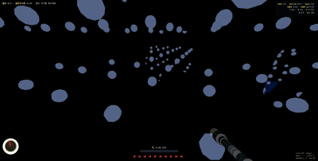

*그림 6-4. 글로우스톤 설치 직후 **간접광이 프로브를 따라 퍼져 수렴하는** 과정(P 키 probe 시각화). 프레임 간 누적으로 빛이 점차 채워지는 것이 곧 강의의 **store & reuse**다.*

### 실시간 GI 기법 분류 (강의 L8)

강의의 실시간 GI 3분류에 본 프로젝트를 대응시키면:

- **Probe 기반(DDGI)** — **현재 채택안**. 위 표 참조.
- **Voxel 기반(LPV/Voxel GI)** — 초기 버전이 복셀 광전파(LPV)였고, git 태그 `lpv-version`으로 보존되어 있다.
- **Surfel 기반(Surfel GI)** — 미사용.

---

## 6. [강의 L5] Texture & Material

### 사용한 텍스처

| Asset | 설명 |
|---|---|
| Rock035 — Color | 석회암/암석 albedo (ambientCG, CC0) |
| Rock035 — Normal(GL) | 표면 요철 노멀맵 (OpenGL 규약) |
| Rock035 — Roughness | 거칠기 맵 |
| compass.png | 나침반 다이얼 HUD |

### UV Mapping

Surface Nets로 생성한 매끈한 동굴 메시는 **UV 좌표가 없다.** 따라서 **Triplanar Projection** 을 사용한다 — 월드 좌표를 X/Y/Z 세 평면에 투영해 샘플하고, 면 법선 가중치로 블렌드한다(이음매 없음).

### Material

`MeshStandardMaterial`(metalness 0)에 `onBeforeCompile`로 triplanar 샘플링을 주입한다. 어두운 암석이라 albedo를 약간 밝게 보정한다.

### Normal Map

노멀맵도 UV가 없으므로 **triplanar whiteout 블렌드**로 3축 노멀을 합성해 월드→뷰 공간 노멀로 변환한다. 이로써 평면 메시에 미세 요철 음영이 생긴다.

| Base Color | Normal (GL) |
|---|---|
|  |  |

*그림 7. Rock035 PBR 텍스처(ambientCG, CC0).*


*그림 8. 손전등을 받은 동굴 벽 — triplanar PBR + 노멀맵 + 버텍스 AO가 적용된 모습.*

### 텍스처 필터링 (강의 L5: Mipmap · Anisotropic)

샘플링 품질을 위해 강의에서 다룬 필터링을 적용한다.

- **Mipmap** — three.js가 텍스처 밉맵 피라미드를 생성해, 멀리 있는 벽/바닥의 축소(minification) 시 **모아레/지글거림(aliasing)** 을 억제한다.
- **Anisotropic Filtering** — 비스듬히 보이는 표면(복도 바닥처럼 시선과 이루는 각이 큰 면)에서 trilinear의 과도한 흐림을 줄이려고 **이방성 필터링(`anisotropy`, GPU 한도와 4 중 작은 값)** 을 켠다.
- **주소 지정(Wrapping)** — 바위 텍스처는 `RepeatWrapping`으로 설정해 triplanar가 월드 좌표를 따라 타일링되도록 한다(UV 없이 무한 반복).


*그림 8-1. 복도 바닥/벽을 낮은 각도(grazing angle)로 본 컷 — 먼 쪽 텍스처가 과도하게 흐려지지 않고 결이 유지된다(이방성 필터링).*

| 가까운 거리 (낮은 LOD/밉맵) | 먼 거리 (높은 LOD/밉맵) |
|---|---|
| 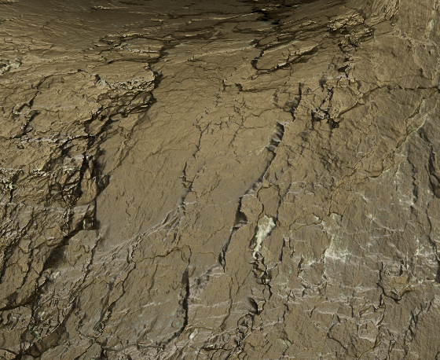 | 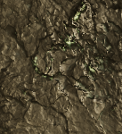 |

*그림 8-2. 같은 암석 텍스처의 **LOD(밉맵 레벨) 비교** — 멀수록 축소(minification)되어 고주파 디테일이 줄고(좌), 가까이서는 원본 디테일이 살아난다(우).*

---

## 7. [강의 L6] Animation

### 캐릭터

**플레이어와 적 모두 Mixamo 스켈레탈 캐릭터**를 `FBXLoader`로 불러와 쓴다.
- **플레이어** — 인간 캐릭터 `Standard Walk.fbx`. 1인칭이라 화면엔 안 보이지만, 이 메시를 **그림자 caster**로 써서 사람 형태 그림자를 만든다(걸을 때 그림자도 걷는다).
- **적(고블린)** — `Walking.fbx`. 여러 마리를 위해 **SkeletonUtils.clone** 으로 스킨드 메시를 정확히 복제한다.

두 캐릭터 모두 **이동 중에만 걷기 클립**을 재생하고 멈추면 `AnimationMixer`를 정지한다.

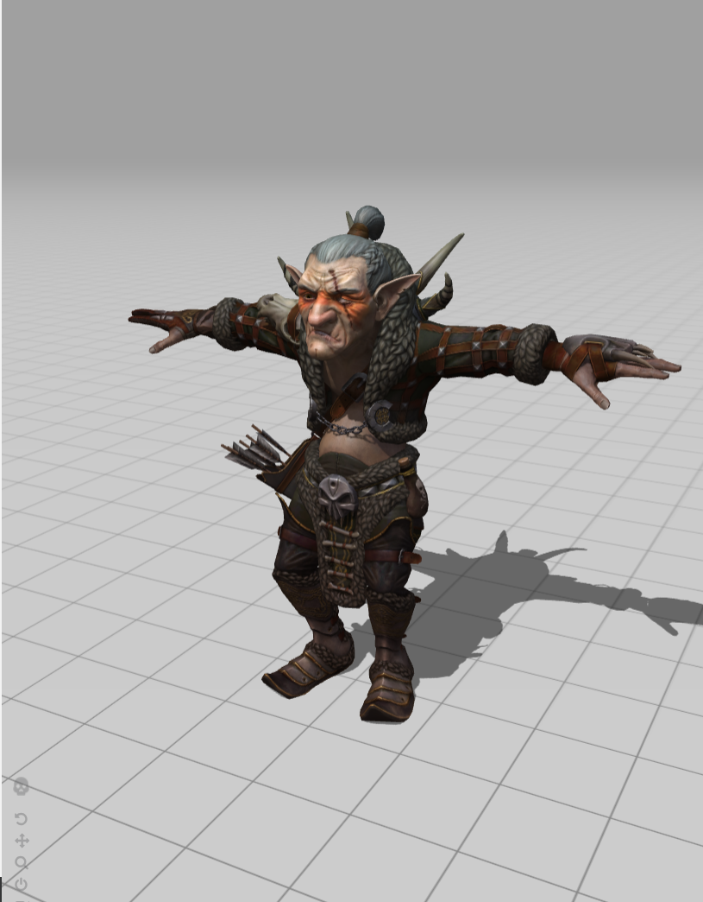

*그림 9. Mixamo 고블린 캐릭터(스켈레탈 리그 + 걷기 애니메이션).*

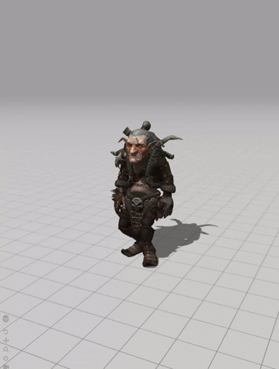

*그림 9-1. `Walking.fbx`를 `AnimationMixer`로 재생한 고블린 — 추격(이동) 중에만 걷기 클립이 돌고, 멈추면 애니메이션도 정지한다.*

### 애니메이션

- **Walking** — `AnimationMixer`로 재생.
- 자체 발광(emissive)을 제거해 **빛을 받을 때만 보이도록** 처리(어둠 속 잠복).

### 상태 전환

```text
정지(애니메이션 일시정지)
    ↓  손전등 빔에 들어옴 (aggro)
이동(Walk 재생) ── 실제로 좌표가 움직일 때만 클립 재생
    ↓  접촉
공격(접촉 1초마다 3 피해)
```

> 멈췄을 때 제자리 걷기를 막기 위해, **실제로 이동한 프레임에만** 애니메이션을 재생하고 아니면 `action.paused = true`로 정지한다.

### 스켈레톤과 스키닝 (강의 L6: Skeleton / Skinned Mesh)

캐릭터(플레이어·고블린)는 **관절 계층(스켈레톤/본)** 과 **스킨드 메시**로 구성된다.

- **스켈레톤(본 계층)** — Mixamo 리그의 본 계층이 곧 강의의 "joint hierarchy"다. 각 본은 부모 기준 **로컬 트랜스폼(회전+오프셋)** 을 가진다.
- **스키닝(skin weights)** — 메시 각 정점이 여러 본에 **가중치**로 묶여, 본이 움직이면 정점이 부드럽게 변형된다(팔꿈치·무릎이 접힐 때 자연스러운 변형).
- **정확한 복제** — 여러 고블린을 위해 `SkeletonUtils.clone`으로 **스켈레톤+스킨드 메시를 함께** 복제한다(단순 `.clone()`은 스킨 바인딩이 깨진다).


*그림 9-2. 고블린이 걸을 때 본(joint)이 움직이며 **스킨드 메시가 관절에서 부드럽게 변형**되는 모습(스키닝 + skin weights).*

### 씬 그래프와 로컬 트랜스폼 (강의 L6)

three.js **씬 그래프(부모-자식 계층)** 와 로컬 트랜스폼을 적극 사용한다.

- **`worldGroup`** 아래에 동굴 메시·글로우스톤·열쇠·고블린이 자식으로 묶여, 스테이지 전환 시 그룹 하나만 교체한다.
- **손전등은 카메라의 자식**(`camera.add(flashlight)`)이라, 카메라의 월드 트랜스폼을 따라 손전등이 자동으로 따라온다(부모→자식 트랜스폼 전파).
- 고블린은 `Group`(위치/방향) 아래에 스킨드 모델을 두어, 이동·회전은 그룹에서, 변형은 본에서 분리해 다룬다.

### FK / IK 와 리타겟팅 (강의 L6)

- **Forward Kinematics(FK)** — 본 작화 클립(Mixamo Walk)은 본 회전을 위에서 아래로 적용하는 **FK 기반**이다. 본 게임은 이 FK 클립을 재생한다.
- **Inverse Kinematics(IK)** — 발을 바닥에 맞추는 등의 IK는 **미적용**(향후 개선 항목). 평탄 보행이라 큰 이질감은 없다.
- **MoCap 기반 클립** — Mixamo에서 제공하는 **스켈레탈 리그와 걷기 클립**(모션캡처 기반)을 그대로 받아 three.js `AnimationMixer`로 재생했다. (리타겟팅을 직접 구현한 것은 아니다.)

---

## 8. AI 및 게임 시스템

### 적 AI

#### 탐지

- **시각(손전등 빔)** — 플레이어 시선 콘 안 + 인식 범위(45) 안에 들어오면 활성화. *(현재 핵심 탐지 방식)*
- 청각/발소리 탐지 — 미구현(향후 계획).

#### 상태 머신

```text
Idle (정지·비가시)
  ↓ 손전등 빔이 닿음
Chase (플레이어의 1/4 속도로 추격, 복셀 충돌·바닥 스냅)
  ↓ 접촉(거리 < 1.4)
Attack (1초마다 3 피해, 화면 흔들림 + 피격음)
  ↑ 손전등 끄거나 빔 밖 → Idle
```

### 아이템

| 아이템 | 역할 |
|---|---|
| 글로우스톤 | 영구 광원 + 간접광(GI). 안전 통로/길 표시. |
| 열쇠 조각 | 출구 잠금 해제(3개). |

### 환경 요소

| 요소 | 역할 |
|---|---|
| 물(Water) | 동굴 저지대의 얕은 물웅덩이(통행 가능). |
| 발광 버섯/광석 | 동굴 표면 장식(생성기 단계). |


*그림 10. 손전등 빛이 닿으면 드러나는 고블린(어둠 속에서는 보이지 않음).*

---

## 9. 레벨 디자인

### 전체 구조

절차적으로 생성된 **방(room) + 복도(corridor)** 동굴(128×64×128 복셀, 방 12개 + 추가 루프 5).

```text
시작(spawn)
  ├─ 방/복도 네트워크 (열쇠 조각 3개가 BFS 거리로 멀리 분산)
  └─ 출구 (입구에서 보행 그래프상 가장 먼 지점)
```

### 진행 구조

| 구역 | 목적 | 핵심 경험 |
|---|---|---|
| 시작 방 | 안전 거점 | 조작·자원 적응 |
| 동굴 본체 | 탐험·열쇠 수집 | 빛 관리, 글로우스톤으로 길 개척, 고블린 회피 |
| 출구 | 탈출 | 모은 열쇠로 잠금 해제 후 귀환 |

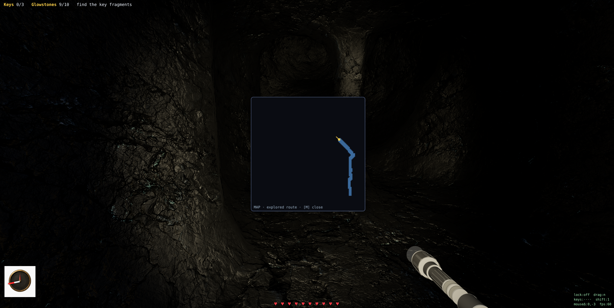

*그림 11. M 키로 보는 맵 — 지나온 경로(파랑)와 현재 위치/방향(노랑)만 표시되는 fog-of-war.*

---

## 10. 최적화

### 사용 기법

- **three-mesh-bvh** — 동굴 충돌 메시에 BVH를 구축해 캡슐-충돌 + 바닥 레이캐스트를 가속.
- **Surface Nets 내부 컬링** — 열린 공간에 면한 표면만 생성(내부 복셀 제외).
- **정적 GI 버스트** — 글로우스톤(정적 광원) GI는 설치 시에만 프레임 분산 버스트로 재계산하고 평상시 프레임당 비용은 0. 정점→셀 매핑은 로딩 시 1회 캐싱.
- **그림자 1광원 제한** — Nearest sampling(`BasicShadowMap`) + 가장 가까운 글로우스톤 1개만 캐스트, 동굴은 receive만(그림자 패스는 플레이어·고블린 등 동적 객체만 렌더).
- **사전 베이크(cave.json)** — 런타임에 생성기를 돌리지 않음(결정론 + 로딩 경량).
- **렌더 비용 캡** — `pixelRatio` 제한, 텍스처 이방성 4로 제한, 동적 라이트 개수 관리.

### 성능 측정

| 항목 | 결과 |
|---|---|
| FPS | **약 50~70 fps** (개발 PC 기준, 화면 우하단 HUD `fps` 표시) |
| 표면 삼각형 | 약 5만 (Surface Nets, 128³ 동굴) |
| 동적 라이트 | 손전등 1 + 글로우스톤 ≤10 + 그림자 광원 1 |

### 분석

충돌과 GI가 모두 동굴 메시의 BVH를 공유하며, 정적 GI(글로우스톤)는 설치 시 버스트로만 추적해 **평상시 GI 비용을 0**으로 만든다. 그림자도 가장 가까운 글로우스톤 1개로 제한해, 개발 PC에서 **약 50~70 fps**로 안정 동작한다.

---

## 11. 검증

### 테스트 항목

- **결정론** — 같은 seed → 항상 동일한 동굴(`cave.json` == 재생성 결과, 바이트 일치).
- **보행 가능성 보장** — 생성기가 walkable 컴포넌트를 보장(미달 시 더 깎아 재시도).
- **풀이 가능성(solvable)** — 입구·출구·모든 열쇠가 하나의 보행 컴포넌트에 속함(BFS 검증).

### 결과

커밋된 맵(seed 1): 128×64×128, walkable 3722칸, SDF 베이크 포함, 입구→출구→열쇠 전부 도달 가능(Solvable: YES). 다수 seed에서 동일 검증 통과.

### 재현 방법

```bash
# 빌드 도구 없음 — 정적 서버로 열기만 하면 됨
python3 -m http.server 8000
# 브라우저에서 http://localhost:8000/game.html  (게임)
#               http://localhost:8000/generator.html (생성기/검증 뷰어)

# 맵 재생성(선택)
node gen.mjs
```

---

## 12. 한계와 향후 계획

### 현재 한계

- **CPU 프로브 추적** — 프레임 분산으로 비용은 제한하지만, GPU(compute) DDGI보다 프로브/광선 수가 적어 간접광 해상도가 낮다.
- **그림자 맵 제한적** — 비용을 위해 Nearest sampling + 그림자 광원 1개(가장 가까운 글로우스톤), 동적 객체만 캐스트. 동굴 표면 자체의 셀프 섀도는 AO/GI 가림으로 대체.
- **애니메이션이 걷기 1종** — Idle/Attack 클립 미적용(멈추면 정지 프레임).
- **단일 바운스** — 표면 직접광만 수집하며, 다중 반사는 시간적 누적을 통해서만 간접 반영.

### 개발 과정의 디버깅 사례

오일러 카메라의 **짐벌 락(gimbal lock)** 으로 위/아래를 볼 때 화면이 Y축으로 폭주하던 문제를 겪었고, 입력 방식 교체 + pitch clamp + YXZ(roll 0)로 해결했다.

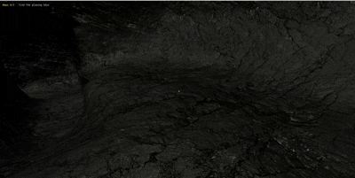

*그림 12. 초기 카메라의 무한 회전(짐벌 락) 현상 — 이후 해결.*

### 향후 개선

- 프로브 조도를 octahedral/SH로 저장해 방향성 간접광 + 다중 바운스 확장.
- 고블린 Idle/Attack 애니메이션 + 청각 탐지.
- 손전등 GLB 업그레이드, 더 다양한 적/구역.

---

### 참고 자료

- three.js (WebGL2 렌더링) — https://threejs.org
- three-mesh-bvh (충돌 가속) — https://github.com/gkjohnson/three-mesh-bvh
- Naive Surface Nets (Mikola Lysenko) — 등위면 메싱
- DDGI (Dynamic Diffuse Global Illumination, Majercik et al.) — 프로브 기반 실시간 확산 GI
- mulberry32 — 시드 가능 결정론 PRNG

### 크레딧

- 제작: 이름입력
- 라이브러리: three.js, three-mesh-bvh, lil-gui(생성기 도구)
- 에셋:
  - 바위 텍스처 — **Rock035, ambientCG (CC0)**
  - 플레이어/고블린 캐릭터·애니메이션(`Standard Walk.fbx`, `Walking.fbx`) — **Mixamo (Adobe)**
  - 손전등 모델 — `flashlight_tactical_mesh.glb` (AI(GPT)로 생성)
  - 나침반 다이얼 — `compass.png` (AI(GPT)로 생성)

